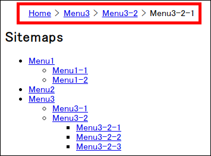

# jquery.breadcrumbs-generator

[](https://www.npmjs.com/package/jquery.breadcrumbs-generator)
[](https://travis-ci.org/sutara79/jquery.breadcrumbs-generator)

jQuery plugin to generate breadcrumb list automatically from sitemap.  
If you can use server-side language (e.g. PHP, Ruby, Perl), you don't need this plugin.




## Demo
https://sutara79.github.io/jquery.breadcrumbs-generator


## Install
- [GitHub](https://github.com/sutara79/jquery.breadcrumbs-generator): Clone or download. Only you need is `dist/`.
- [npm](https://www.npmjs.com/package/jquery.breadcrumbs-generator): `npm i jquery.breadcrumbs-generator`
- CDN ([jsDelivr](https://github.com/jsdelivr/jsdelivr#usage)):
    - jquery.breadcrumbs-generator.min.js: [v1.0.3](https://cdn.jsdelivr.net/npm/jquery.breadcrumbs-generator@1.0.3/dist/jquery.breadcrumbs-generator.min.js)


## Usage
###### &lt;head&gt;
```html
<script src="https://code.jquery.com/jquery-3.2.1.min.js"></script>
<script src="jquery.breadcrumbs-generator.min.js"></script>
<script>
$(function() {
  $('#breadcrumbs').breadcrumbsGenerator();
});
</script>
```

###### &lt;body&gt;
```html
<ol id="breadcrumbs"></ol>
<ul id="sitemaps">
  <li>
    <a href="index.html">Home</a>
    <ul>
      <li><a href="menu1.html">Menu1</a></li>
      <li><a href="menu2.html">Menu2</a></li>
      <li><a href="menu3.html">Menu3</a></li>
    </ul>
  </li>
</ul>
```

###### CSS
```css
#breadcrumbs li {
  display: inline-block;
}
#breadcrumbs li:not(:first-child) {
  margin-left: 0.4em;
}
#breadcrumbs li:not(:first-child):before {
  content: '>';
  margin-right: 0.4em;
}
```

## Note
##### Breadcrumbs structure
This plugin creates like `<li><a href="#">foo</a></li>`.  
So, you should use `<ol>` or `<ul>` for breadcrumbs.

##### Sitemaps structure
This plugin searches for current-page and its ancestors in href-attributes of the sitemaps.  
So, you don't use href-attribute for other purpose in the sitemaps.

##### How to move the home-link to the list of breadcrumbs
If you use `#sitemaps` as a global-navi, and don't need the home-link, you can also move it to `#breadcrumbs`.

```html
<ol id="breadcrumbs"><li><a href="index.html">Home</a></li></ol>
<ul id="sitemaps">
  <li><a href="menu1.html">Menu1</a></li>
  <li><a href="menu2.html">Menu2</a></li>
  <li><a href="menu3.html">Menu3</a></li>
</ul>
```

## Options
You can set options like followings.

```javascript
$('#breadcrumbs').breadcrumbsGenerator({
  sitemaps: '#sitemaps',
  index_type: 'index.html'
});
```

|Name      |Type  |Default     |Description                |
|----------|------|------------|---------------------------|
|sitemaps  |string|'#sitemaps' |jQuery selector for sitemap|
|index_type|string|'index.html'|Filename of directory index. This is for when the requested url is a directory (e.g. `example.com/`), not a file (e.g. `example.com/index.html`).|


## Compatibility
- jQuery: >=3.0.0 ([because of XSS vulnerability](https://nodesecurity.io/advisories/jquery_xss))
- Browser: Chrome58, Firefox53, IE11, Edge14


## License
[MIT](http://www.opensource.org/licenses/mit-license.php)


## Author
[Yuusaku Miyazaki](http://sutara79.hatenablog.com/entry/2015/04/04/215219)
( <toumin.m7@gmail.com> )